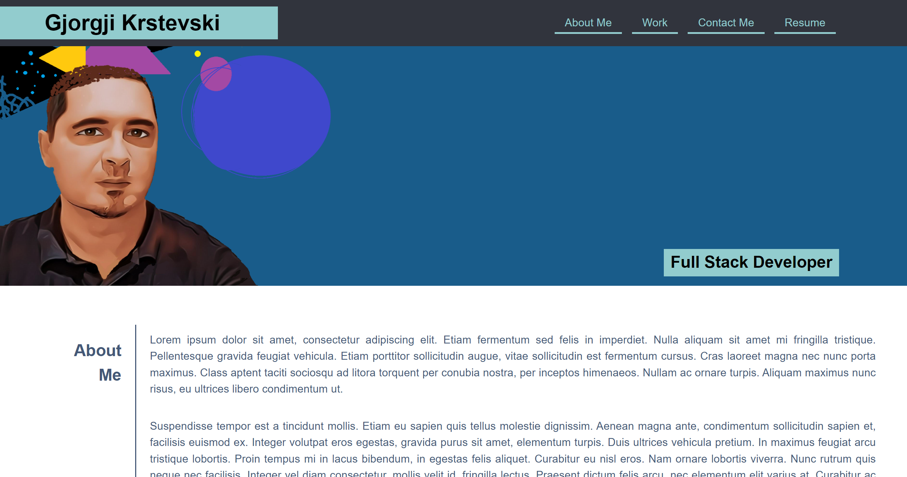
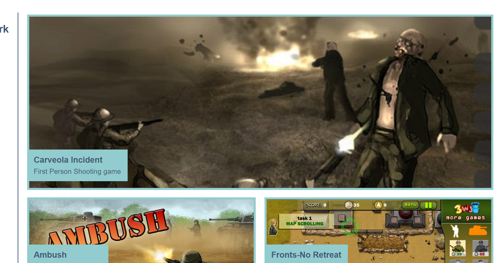
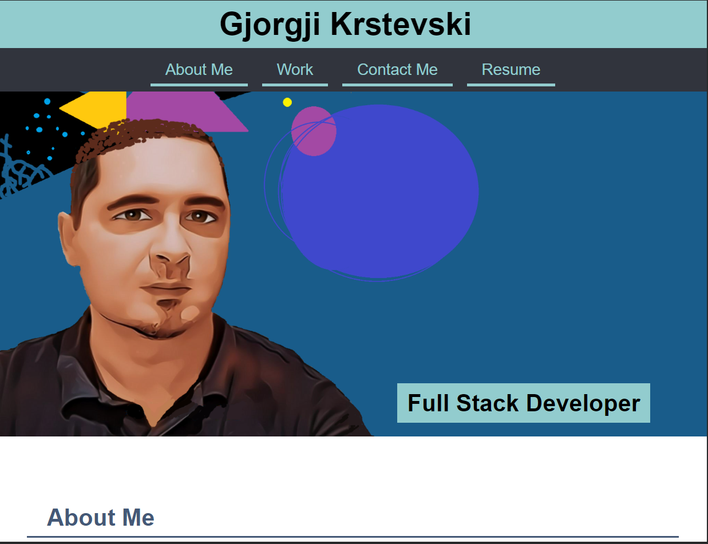
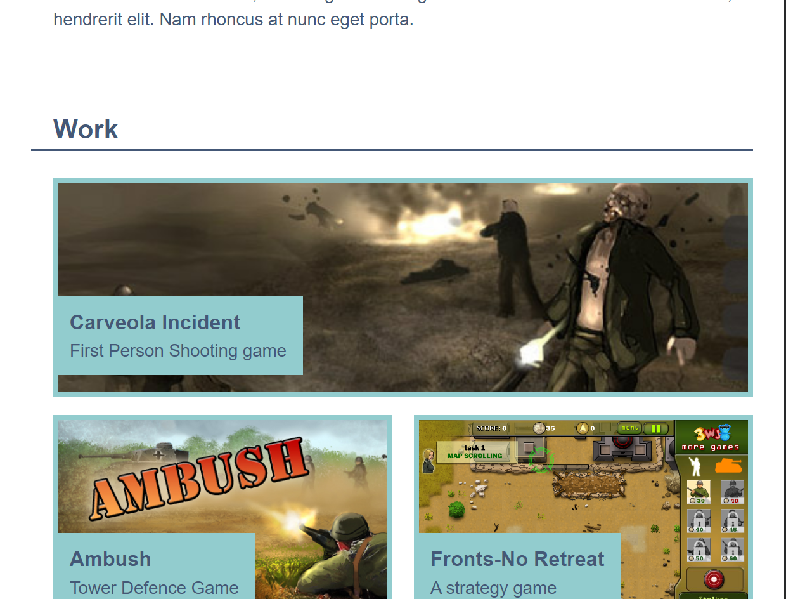
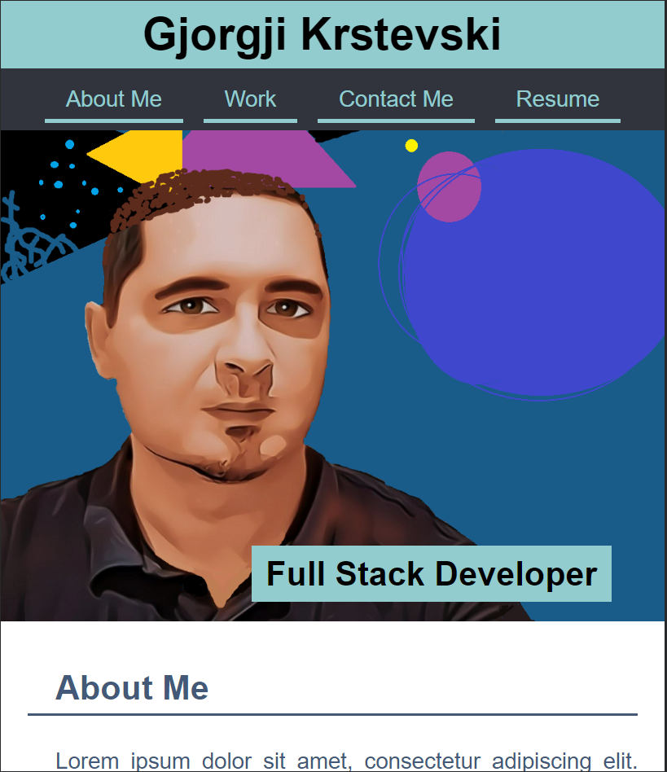
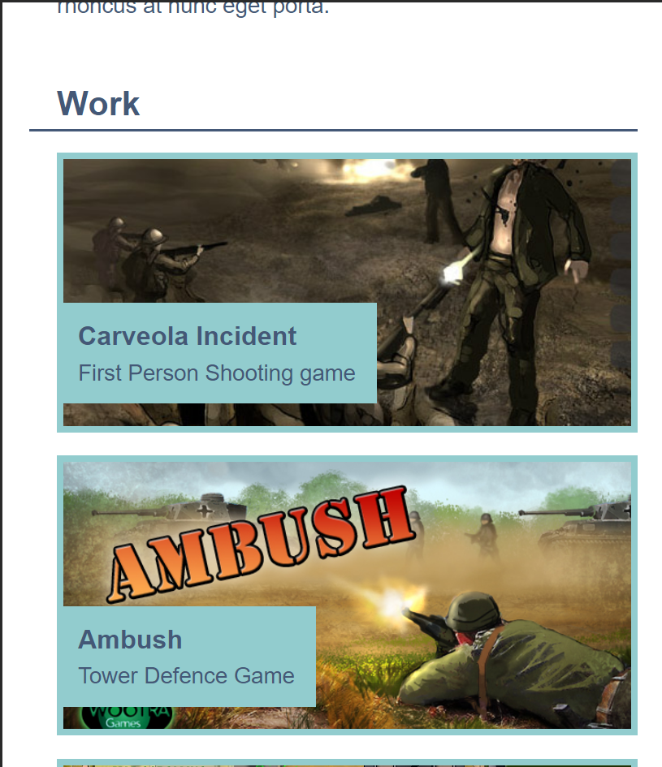

# Work-Portfolio
Website to showcase work achievements and skills

## Instructions

A responsive, personal web site that shows the works and skill of a developer, with navigations links that will take the user to the specific section of the page and thumnails and links of particular work done. At the bottom of the web page, there is a link section which can be used for contacting the developer.

You can find live preview in this link : [Preview](https://joekrstevskigj.github.io/Work-Portfolio/)

### Screenshot 1 ###
This shows the header part of the page, along with the navigation

### Screenshot 2 ###
The content of the page

### Tablet View ###
Tablet View of the top part of the page

### Tablet View 2###
Tablet View of the content part of the page

### Phone View ###
Phone View of the top part of the page

### Phone View 2###
Phone View of the content part of the page
